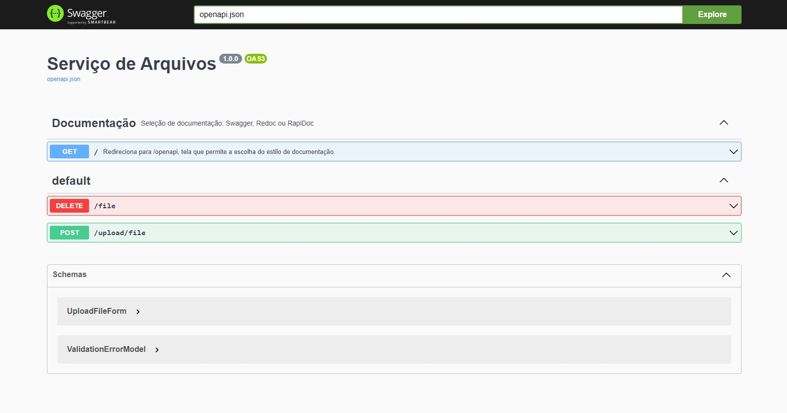

# Files Service
Serviço de gerenciamento de arquivos




---
## Tecnologias e Arquitetura
- **Flask**: micro-framework python;
- **Documentação**: atráves da lib `flask-openapi3` temos aqui uma rica documentação, podende ser: Swagger, ReDoc ou RapiDoc.

## Como rodar o projeto

### LOCALMENTE
Primeiramente temos que instalar as libs presentes em `requirements.txt` com o seguinte comando:
  ```
  pip install -r requirements.txt
  ```
Depois que as libs foram instaladas, podemos executar o projeto com o comando:
  ```
  flask run --host 0.0.0.0 --port 5001
  ```
  ou em modo de desenvolvimento:
  ```
  flask run --host 0.0.0.0 --port 5001 --reload
  ```
---
### DOCKER
Primeiro crie a imagem com o seguinte comando:
```
  docker build -t mvp-files-service .
```

depois rode a imagem com o seguinte comando:
```
  docker run -p 0.0.0.0:5001:5001 --name mvp-files-service mvp-files-service
```

Abra o [http://localhost:5001/](http://localhost:5001/) no navegador para verificar o status da API em execução.